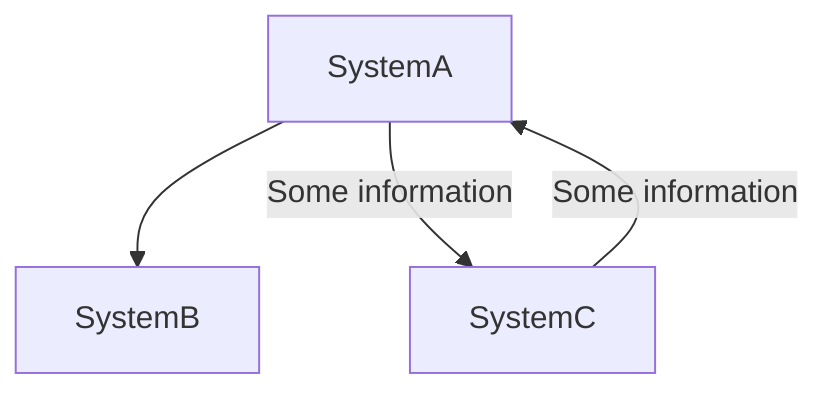
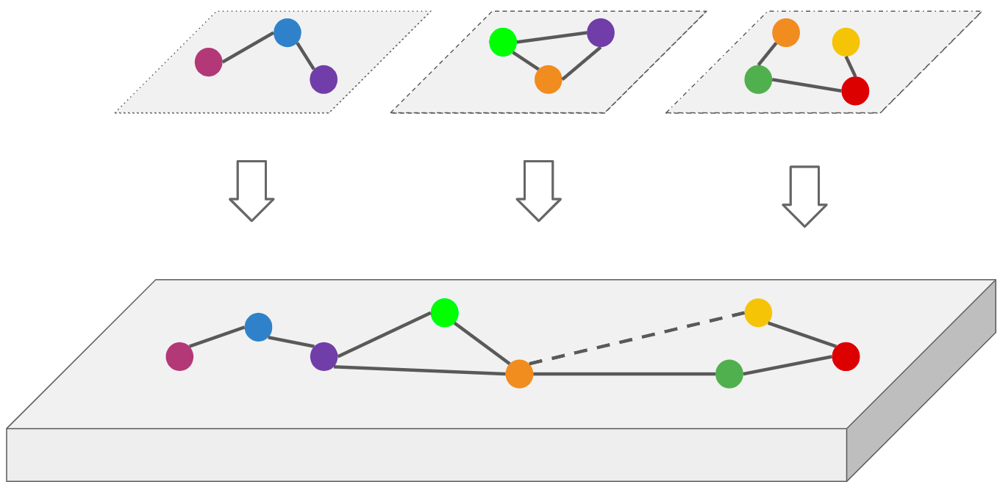

# Overview

Our mission is to create a open source tool to help Solution/Software Architects, Tech Leads, Principals and General IT folks to understand how the applications are connect in the ecosystem of the company and some other features that are needed for this job.

Different from other software we will achieve enterprise grade product that are only paid, it means, that we aren't delivering a diagram tool but a enterprise grade style where all objects are connect and can be reutilized in any kind of view.

There are several ways to map architecture with a lot of different frameworks, such:

- [Archimate](https://www.archimatetool.com/)
- [UML](https://pt.wikipedia.org/wiki/UML)
- [TOGAF](https://www.opengroup.org/togaf)
- [C4 Model](https://c4model.com/)

Our idea here is to adopt C4 Model, we strongly believe that C4 is simple enough for more than one use case

## Overall status
This product is in very early stage and if you want to join the team please contact me on linkedin: https://linkedin.com/in/brunopenso

## General idea

Based on the C4 Model we are bringing first the Level 1 of architecture, or System Context Diagram. You can read more [here](https://c4model.com/#SystemContextDiagram)

So when creating new diagrams, you can:

- Create a new system or reuse one that already exists
- Create connections between 2 systems or reuse existing

With this behavior you can see all systems and connections in one unique place and in the future releases see graphs and system interactions

## How it works

The image above represents the general way of working.

In the top part of the image you have 3 view points of part of the data that were build in different times from different people.

The bottom part represents all objects from all view point, meaning:

- All objects are connect
- You can reuse objects and connections
- You can see the entire context together